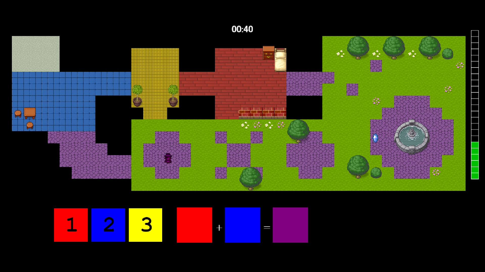

# Camo Caper

## Authors
- *Matt Miller*
- *Zihan (Anna) Wu*

## Blurb
- *Camo Caper is a top-down stealth game designed to teach color mixing and color theory. Play as the famous cat thief with a magical color changing cape on a heist for the newest collection of priceless gems. Maneuver through maps, while blending in with the background to avoid getting spotted! Stay hidden, stay sneaky. If you are visible for too long, the guards will catch you!*

## Short Instructions
- *Use the arrow keys to move. Use numbers 1,2,3 to mix colors and 4 to clear color palette. SPACE submits the color change. Put in 2 different colors to create a new color!*

## Screenshot

## Gameplay video link
[Link to video](https://youtu.be/XTB5pU0WMj8)
